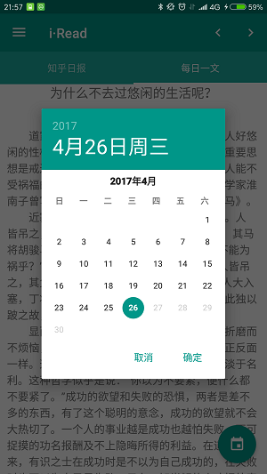

# 练手App#iRead#完成知乎日报和每日一文功能

# 界面效果
     
 
     
 
     
 
     
 
# 相关知识
 * Activity+Fragment显示模式
 * Material Designer设计原则的使用
     * DrawerLayout+NavigationView
     * CoordinatorLayout+AppBarLayout+ToolBar
     * FloatingActionBar
     * Snachbar
     * SwipeRefreshLayout
     * CollapsingToolbarLayout
 * ViewPager+TabLayout+Fragment滑动切换
 * RecyclerView的使用
 * Volley网络框架使用
 * MVP架构
 * Glide图片加载框架
 * 单例模式
 * Json解析工具